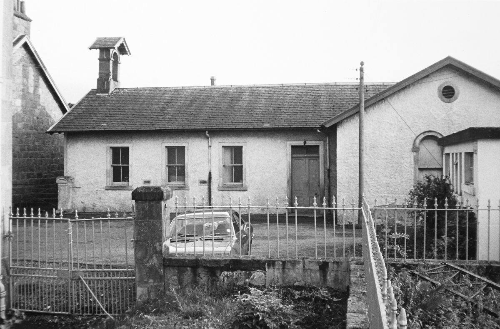
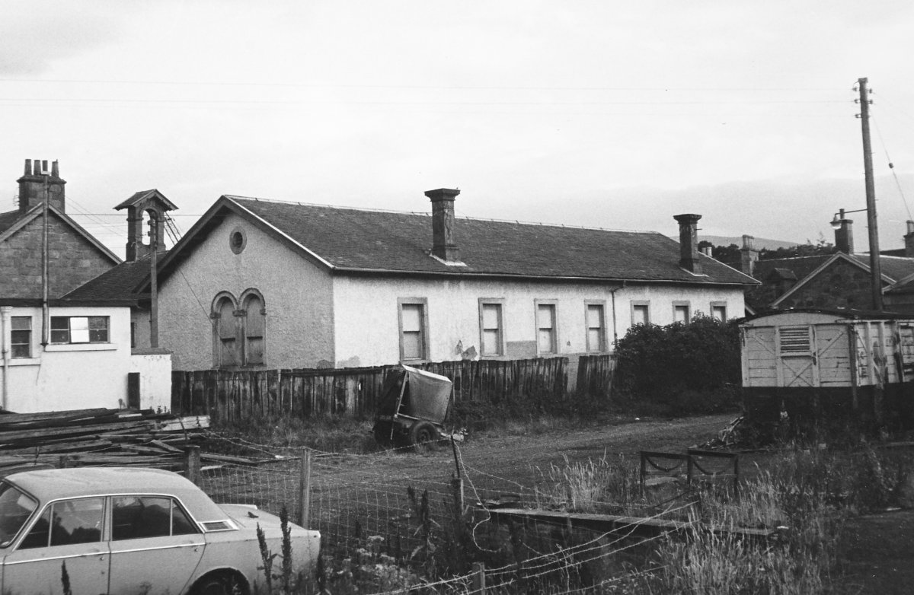

#### Aberlour Schools

There is record of a dame School at Burnside Cottage in 1864.
A dame school was a small school
open to both female and male pupils of all ages
and run by a single teacher,
usually an unmarried woman.
This model was developed in Britain
and used in the the British colonies in America and Canada.
In 1875, Burnside Cottage was established
as the beginning of the Aberlour Orphanage.
Four “mitherless bairns” lived there
with the Rev. Charles Jupp and his wife.

The first village School was located in “Glenmorag”,
the building that sits at the junction of High Street and Victoria Terrace.
One of the oldest buildings in Aberlour,
Glenmorag has housed a great variety of businesses over the years.

Before the construction of Victoria Terrace,
the ground behind the old school was the headmasters garden
and the playground ran all the way to the Spey.

One of the best known Aberlour headmasters was Charles “Schooley” Grant.
Charles was born at Strondhu,
in the parish of Knockando,
where his father was a farmer.
Charles was a great storyteller
and famous for his skill and knowledge of Highland music.
He could play strathspeys on either the fiddle or the bagpipes.
Also a composer,
Charles wrote the famous strathspey “Benrinnes”,
and his compositions can be found in many collections of Highland music.
In the summertime,
Charles would play his fiddle outdoors
to the delight and entertainment of the villagers.
He became the headmaster of the new school in 1864.
Charles died in 1892 at the age of 85.

<figure>
    
    <figcaption>
        [https://www.trove.scot/image/1640713](https://www.trove.scot/image/1640713)
    </figcaption>
</figure>

#### The Closure of the School

Opposite the parish church,
the school was built with money gifted by Margaret Macpherson Grant
and replaced the existing school based at Glenmorag.
The school served the community until 1897
when it was condemned as unsanitary,
as the toilet facilities were inadequate for an increasing number of pupils
prior to the opening of the Orpanage school in 1889
and the increasing population of Aberlour.

A new school
(the present primary school, as of 2025)
was built in Mary Avenue
and on its opening day
the pupils from the old school
were marched in procession to the new school.
The parade was led by the headmaster
who carried the bell from the old building to its new home.
The bell from the bellcote
hangs in the present Aberlour primary school.

<figure>
    
    <figcaption>
        [https://www.trove.scot/image/1640712](https://www.trove.scot/image/1640712) 
        These pictures are of the school building c. 1975-76.
        The bell from the bellcote
        hangs in the present Aberlour primary school.
    </figcaption>
</figure>

#### Architect

> The school building was designed
> by Thomas Mackenzie (1841-54) of Mackenzie and Matthews
> in 1850,
> but was built sometime after Mackenzie's death
> (it does not appear on the 1855
> <cite>Plan of the Burgh of Barony of Charleston of Aberlour</cite>).
> Despite his short life,
> Mackenzie was a prolific architect.
> Born in Perthshire,
> he moved to Aberdeen in 1835
> and trained with both John Smith and Archibald Simpson.
> In 1839 he moved to Elgin,
> taking over William Robertson's practice in 1841,
> where he was joined by James Matthews in 1844.
> Mackenzie was a competent handler of building styles,
> and among more famous buildings are
> the neo-Tudor Milne's High School at Fochabers (1845-6)
> and the Italianate Elgin Museum (1842).

<cite>From [the Historic Environment Scotland listing][listing].</cite>

[listing]: https://portal.historicenvironment.scot/designation/LB20874
