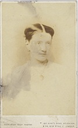
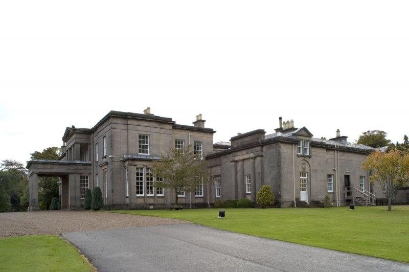
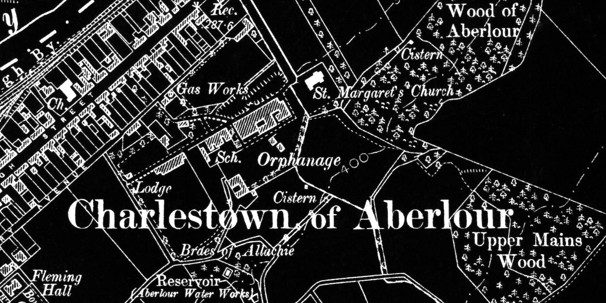
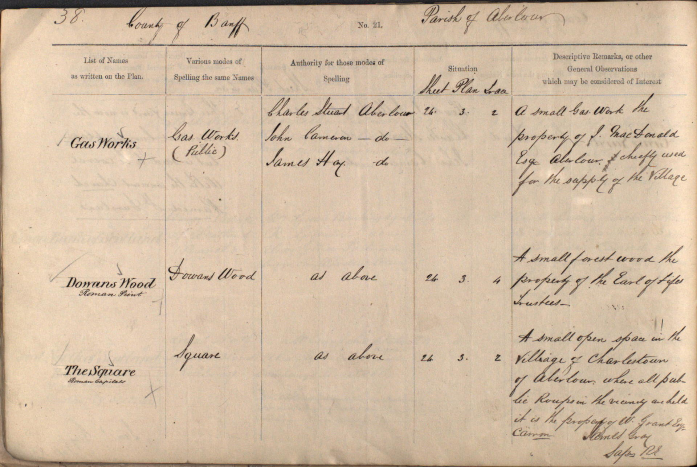
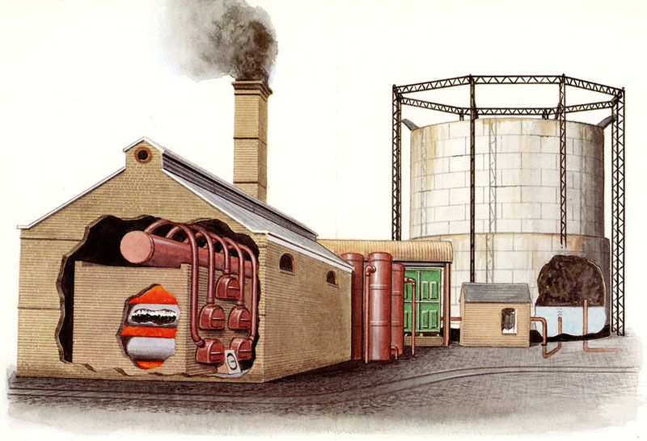

Kohlegas wurde im frühen 19. Jahrhundert für Beleuchten und Kochen in Schottland eingeführt. Viele Städte und Gemeinden und mehrere große Landgüter ließen ihre eigenen Gaswerke bauen, um ihren Bedarf zu decken.

In 1858 wurde bei einem Treffen im örtlichen Hotel beschlossen, in Aberlour ein Gaswerk zu bauen. Margaret Macpherson Grant und ihr Vater, Dr. Macpherson, einigten sich darauf, ein Drittel der Anteile an der neuen Firma zu kaufen und die Versorgungsleitung zu den Häusern in der Stadt auf eigene Kosten zu finanzieren. (Siehe den Artikel <cite>Morayshire Advertiser</cite> weiter unten.)

Margaret hatte das Aberlour Estate und großen Reichtum nach dem Tod ihres Onkels Alexander Grant, einem ehemaligen Besitzer einer Zucker- und Tabakplantage in Jamaika, geerbt. Margaret wurde eine große Wohltäterin der Stadt.

Unten abgebildet ist eine Kopie des einzigen verifizierten Fotos von Margaret sowie eines modernen Fotografen aus ihrem Haus in Aberlour House.

Die heutige Hill Street in Aberlour hieß ursprünglich Gas Road und ist den Einheimischen als Gas Lane bekannt. Noch im Jahr 2003 bezeichnete die Website des örtlichen Busunternehmens Stagecoach die Bushaltestellen an der High Street als „Gas Road-Haltestellen“.

<ul class="gallery">
    <li>
        <figure>
            
            <figcaption>Margaret Macpherson Grant</figcaption>
        </figure>
    </li>
    <li>
        <figure>
            
            <figcaption>Aberlour House</figcaption>
        </figure>
    </li>
    <li>
        <figure>
            ![Aberlour.—We understand a meeting of the inhabitants of the thriving village of Aberlour convened in the Hall of the Hotel to consider the practicability of introducing gas into the village, when a committee was formed for the purpose of procuring a proper site for the works, and to ascertain the probable expense. Miss Grant of Aberlour and Dr McPherson have most generously agreed to take shares to about one-third of the necessary fund for building, and to lay the main pipe to the houses of Aberlour—free of expense to the company—an offer which was duly appreciated by the meeting, and gratefully accepted. The committee appointed are to meet on the 28th inst., and to lay their report of the probable expense of the contemplated works before a public meeting of those favourable to the enterprise.](assets/img/morayshire-advertiser.jpg)
            <figcaption><cite>Morayshire Advertiser</cite>, Donnerstag, 20. Januar 1859.</figcaption>
        </figure>
    </li>
    <li>
        <figure>
            
            <figcaption>Standort des Gaswerks. <cite>[Ordnance Survey Elginshire Sheet XXIII.SW](https://maps.nls.uk/view/75530244)</cite>, veröffentlicht 1905. Wiedergabe mit Genehmigung der National Library of Scotland.</figcaption>
        </figure>
    </li>
    <li>
        <figure>
            
            <figcaption>Eigentum und Beschreibung des Gaswerks. <cite>[Ordnance Survey Name Books, 1867-1869](https://scotlandsplaces.gov.uk/digital-volumes/ordnance-survey-name-books/banffshire-os-name-books-1867-1869/banffshire-volume-01/38)</cite>, Band 1, Seite 38.</figcaption>
        </figure>
    </li>
    <li>
        <figure>
            
            <figcaption>
                [Ein kleines städtisches Gaswerk in den 1870er Jahren.](https://www.locallocalhistory.co.uk/brit-land/power/page07.htm)
            </figcaption>
        </figure>
    </li>
</ul>

---

#### Kohlengas

Kohlegas (Stadtgas) wurde durch Erhitzen von Kohle unter Luftabschluss hergestellt. Kohlegas wurde in den 1790er Jahren vom schottischen Erfinder William Murdoch als Beleuchtungsgas in Großbritannien eingeführt und wurde weithin zum Beleuchten, Kochen, Heizen und Antreiben von Gasmotoren verwendet.

Die Kohle wurde in einer Retorte erhitzt und das Rohgas durch einen Kondensator geleitet, um den Teer zu entfernen. Es gab einen Wäscher, um andere Verunreinigungen zu entfernen. Der in der Retorte verbleibende Rückstand war Koks.

Die Zusammensetzung des Kohlegases variiert je nach Kohleart und Reaktionstemperatur. Typische Zahlen waren:

* Wasserstoff 50%
* Methan 35%
* Kohlenmonoxid 10%
* Ethylen 5%

Die Nebenprodukte des Prozesses waren wertvoll. Dazu gehörten Koks, Kohlenteer, Schwefel und Ammoniak. Sie wurden zur Herstellung von Farbstoffen, Medikamenten und Dutzenden von organischen Verbindungen verwendet.

Koks wurde bei der Herstellung von Eisen und Stahl verwendet, obwohl dies in Großbritannien so gut wie aufgehört hat. Koks wird auch als rauchfreier Brennstoff verwendet.

Kohlenteer wurde destilliert, um verschiedene Produkte zu gewinnen, darunter:

* **Teer** für Straßen
* **Benzol** - Motorkraftstoff
* **Kreosot** - Holzschutzmittel
* **Phenol** - wird bei der Herstellung von Kunststoffen verwendet
* **Kresol** - Desinfektionsmittel
* **Schwefel** für Schwefelsäure
* **Ammoniak** für Dünger.

Kohlegas wird in Großbritannien nicht mehr hergestellt. Es wurde zunächst durch Erdgas aus Erdöl, dann durch Erdgas aus der Nordsee ersetzt.
